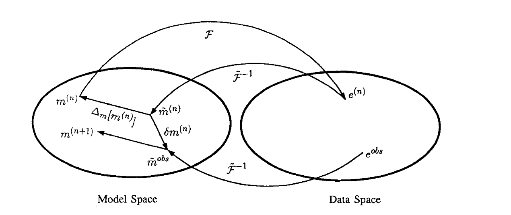

## Inversion of geophysical data using an approximate inverse mapping

_Douglas W. Oldenburg & R. G Ellis_

[https://doi.org/10.1111/j.1365-246X.1991.tb06717.x](https://doi.org/10.1111/j.1365-246X.1991.tb06717.x)

## Summary

The method uses accurate forward modelling to compute responses, but only uses an approximate inverse mapping to map data back to model space 

## Citation
